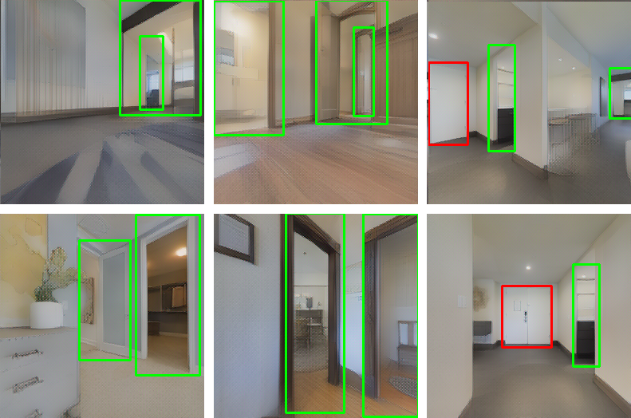
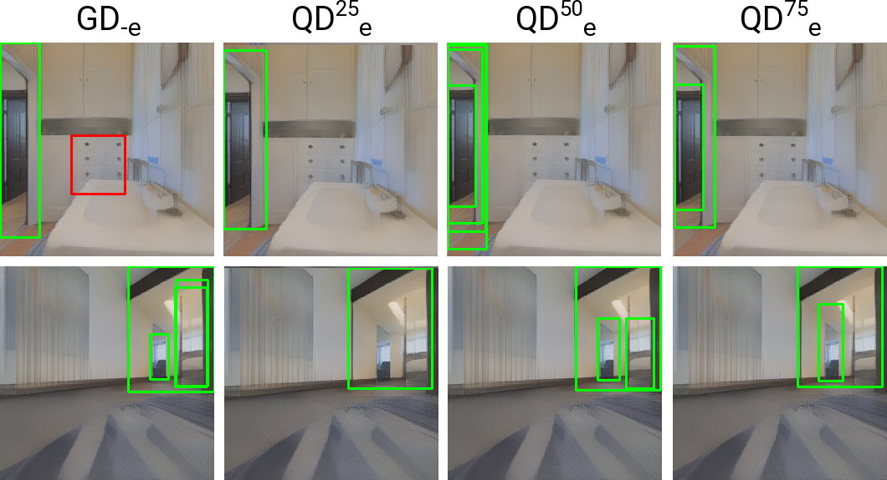
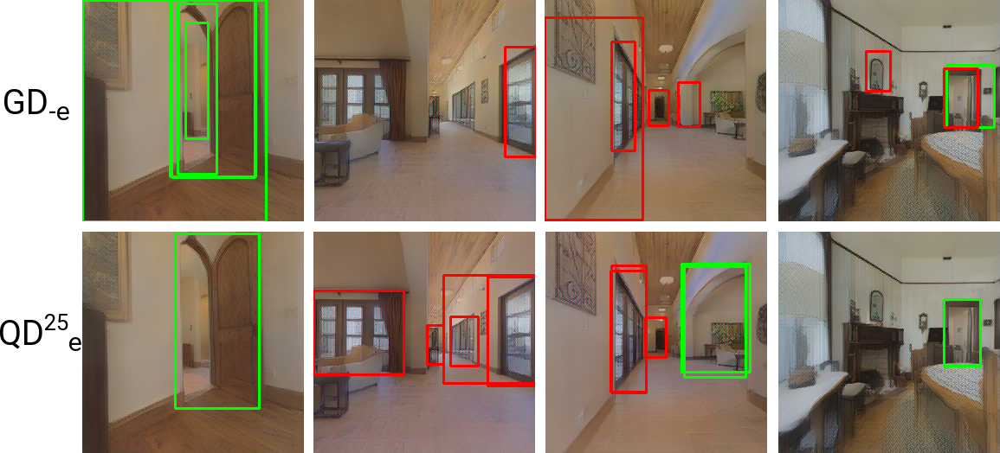

# Enhancing Door Detection for Autonomous Mobile Robots with Environment-Specific Data Collection

Here you can find the code and the datasets used in the article entitled **Enhancing Door Detection for Autonomous Mobile Robots with Environment-Specific Data Collection**
To use this package and install all the dependencies, clone this repository and run:

```pip install -e .```

Datasets links:
* The relabelled version of *DeepDoors2* dataset [link](https://unimi2013-my.sharepoint.com/:u:/g/personal/michele_antonazzi_unimi_it/EX1sP643dctKswmWsVBiCLoBtyOdkSsxi5fpZJy3mnoaBg?e=8YHUOn)
* The collected dataset in simulation [link](https://unimi2013-my.sharepoint.com/:u:/g/personal/michele_antonazzi_unimi_it/EVYqJ4lErGNIhzUpqK7HDjQBoz2vQ-17acmi3NCpmE2xRw?e=sBRjqr)
* The collected dataset in the real world [link](https://unimi2013-my.sharepoint.com/:u:/g/personal/michele_antonazzi_unimi_it/EXLStATEcj9Hhd06k4AcU0EBTB7J3pUUG_At9Ar60NpI3g?e=IWRRth)

## Simulation Environment

To acquire the visual dataset we use an extended version of Gibson, obtainable [here](https://github.com/micheleantonazzi/GibsonEnv.git).
The simulator is automatically installed with the above command `pip install -e .`.
The door dataset has been acquired by virtualizing through Gibson the environments of Matterport3D. 


## Pose extractor

The code to extract plausible positions of a mobile robot to acquire the images is in [positions_extractor](doors_detection_long_term/positions_extractor) package.

## Baseline
The code of the baseline (with the relative configuration parameters) is in [baseline.py](doors_detection_long_term/doors_detector/baseline/baseline.py).

## The door detector

The proposed detector is coded [here](doors_detection_long_term/doors_detector/models). To download the trained models, click [here](https://unimi2013-my.sharepoint.com/:f:/g/personal/michele_antonazzi_unimi_it/Er7n154eKXtHqESgk2MahoQBa_t7hka5grS7N4ELkamqvg?e=e7SmXl) and copy the donwloaded files in this [folder](doors_detection_long_term/doors_detector/models/train_params)

## Results

In this paper, we present a door detector for autonomous robots to find doors and their status (open or closed) in RGB images. We built a *general detector* and a technique to increase its performance in the specific operational environment of the robot. This technique, based on the fine-tune paradigm, produces a *qualified detector* fine-tuned with new examples acquired directly from the target environment *e*. We test this approach in 10 different photorealistic simulated environments, producing a general detector *GD<sub>-e</sub>* without any knowledge about *e* and three qualified modules (starting from *GD<sub>-e</sub>*) fine-tuned with the 25%, 50%, and 75% of the new examples collected in *e*. We call these detectors *QD<sup>25</sup><sub>e</sub>*, *QD<sup>50</sup><sub>e</sub>*, *QD<sup>75</sup><sub>e</sub>*. 

Our results shows that the proposed general detector *GD<sub>-e</sub>*  correctly detects doors also with any knowledge of a target environment *e*.



We also demonstrate that the detection accuracy increases with consecutive fine-tune operations.



Another interesting outcome is that the best performance increment is reached with the smallest fine-tune operation (*QD<sup>25</sup><sub>e</sub>*) which requires the lowest effort to acquire and label the new examples.


